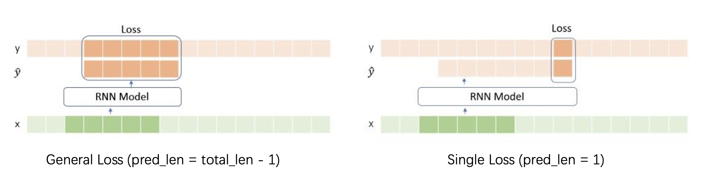
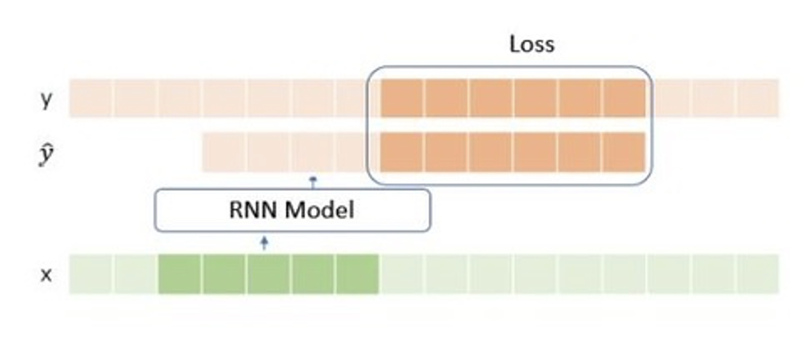
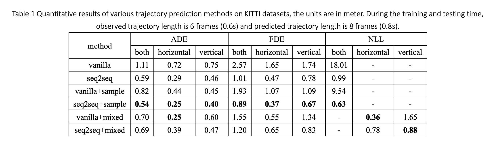
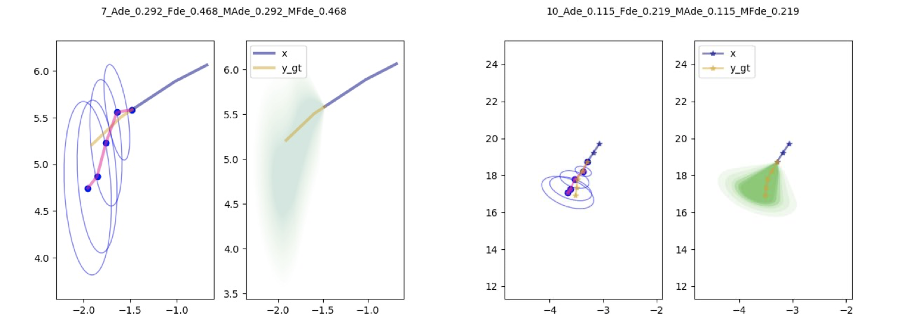
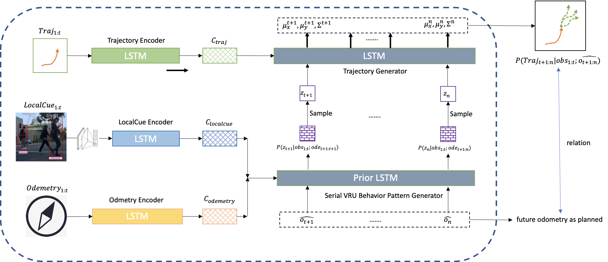

# Pedestrian Trajectory Prediction on KITTI [EN]

**Notice: Due to commercial  confidentiality agreement, complete source codes and new dataset are not available yet. The repository currently only contains baseline experiments under public KITTI dataset.** 

### Environment 

Pytorch = 1.4.0

### Dataset - KITTI

**KITTI Ref**: [KITTI Tracking Evaluation 2012](http://www.cvlibs.net/datasets/kitti/eval_tracking.php)

**Data Pre-processing: **

- Use object records with object tag = 'pedestrian' and 'bicycle' in all scenes. If the length of filtered continuous frames in a scene are lower than setting, then the scene will be dropped. 
- Pick the coordinates in the forward/backward and left/right directions. 
- Absolute coordinates normalization. 
- Concatenate frame features to spatial-temporal tensor [frame, object_id, feature]

### Model

#### Vanilla LSTM

**Training:** 

- **Loss**: Average Displacement Loss or Negative Likelihood Loss. 
- **Loss Window**: By changing the parameter 'pred_len' to determine how many frames are involved in loss computation backwards. If 'pred_len = 1', the architecture is many-to-one. If 'pred_len = total_len - 1', then all the model's outputs are involved in loss computation. 
- **Optimizer:** Adam

**Inference:**

- **Auto-Regressive Prediction**: The prediction is a multi-step process. Having the output corresponding to the last input of ground truth data as the first prediction step, the process will interactively use current step to predict the next step. 
- **Predicted Gaussian Distribution and Sampling:** For quantitative uncertainty estimation, we assume the prediction to be 2D Gaussian distribution. To align the input format in prediction with the input in encoding, sample technique is used for getting 2D coordinates. 

#### Seq2Seq LSTM

**Training:** 

- **Process**: The training process can be divided into two steps. The first step is encoding, in which observed features (trajectories, etc.) will be sequentially encoded into a semantic feature vector. Then in the second step, having the semantic vector as the initial hidden state, the LSTM decoder will output predicted trajectories. 
- **Auto-Regressive Prediction:** Similar to Vanilla LSTM, the method has the output format with 2D Gaussian Distribution for uncertainty estimation. In decoding, the mean values along two coordinates will be used as input for auto-regressive prediction. 
- **Optimizer:** Adam

**Inference:** The inference process of Seq2Seq LSTM is similar to the training process. One big difference is that sampling predicted Gaussian distributions replaces choosing mean values  in auto-regressive prediction, since the sampling technique could improve prediction multiplicity.  

### Experiment Result

### Future Work

- :white_check_mark: **Bounding Box**: Encode extra features of bounding boxes. 
- :white_check_mark: **Relative location**: Normalized absolute coordinates (location) -> Non-normalized relative coordinates (offset from the previous place). 
- :white_check_mark: **Laplacian**: Apply two independent probability distributions along two directions. Adopt relative Laplacian distribution in forward/backward direction, since the distribution gives different weights to the same absolute prediction errors in different distance away from ego-centric vehicles. 
- :white_check_mark: **Sampling Times**: The relation between the prediction performance and the number of sampling. 
- :flags: **Odometry**:  Encode the odometry of ego-centric vehicles. 
- :white_check_mark: **Visualization of Predicted Distribution**

- :flags: **GAN and VAE**: Adopt GAN or VAE network to predict multiple plausible trajectories. 

# Pedestrian Trajectory Prediction on KITTI [CN]

环境要求：

pytorch=1.4.0

## 数据集

模型基于KITTI车载数据集，选取所有场景中标签为行人（pedestrian）的物体，选取在车辆运行方向的两类坐标（单位为米），生成指定长度的数据集。

数据再经过预处理，绝对坐标变换为相对坐标（t时刻相对于t-1时刻的位移）。

## 模型

当前模型实现了Vanilla和Seq2Seq两种模型，主要差异在于是否在训练时构成了Encoder-Decoder结构。模型推理的模块可拔插，既可以作为训练时验证，又可以单独作为测试使用。

### Vanilla模型

**训练**：模型输入与模型输出同时进行，训练参数中的pred_len可以指定在计算损失值时选取输出值的倒数多少个参与，从而自定义给模型多长时间的适应时间短（该段时间的输出不参与损失值计算），当pred_len取1时就是many-to-one的结构，当pred_len取total_len-1时就要求所有输出都参与loss的计算。

**推理（验证/测试）**：最后一步Ground Truth输入经过序列模型后得到第一个预测的高斯分布，而后对该分布进行随机采样，得到的坐标预测作为模型的输入，而后迭代地输出得到预测结果。（考虑到存在采样，因此定义了采样次数，以便多次预测）

### Seq2Seq模型

**训练**：模型输入和模型输出分步进行，在编码阶段将模型输入转换为语义向量，在解码阶段，语义向量作为解码器的初始隐藏状态，解码时模型的每一步输入源自于上一步输出的分布中两个均值的参数。计算损失函数时，解码器的所有输出都需要参与。

**推理（验证/测试）**：类似于训练，唯一不同的是，解码时模型的每一步输入源自于上一步输出的分布进行采样而形成，这样有助于进行多次预测）

## 数据与模型的进一步扩充

- :flags: 在seq2seq模型中的编码器里加入行人框的信息。
- ✅ 尝试使用不归一化的绝对坐标作为数据，并加入batch-normalization在运行时归一化。
- ✅ 采用两个独立的分布预测横向和纵向的行人轨迹信息，并将纵向的分布改进为对更近行人预测错误更敏感的拉普拉斯分布。
- ✅ 对于分布的输出，研究轨迹采样的次数与预测误差的关系。
- :flags: 在vanilla和seq2seq模型中加入里程流信息。
- ✅ 轨迹预测结果的可视化：多次采样输出、高斯椭圆等。
- :flags: 将GAN架构的模型运用在单行人轨迹预测上，不考虑social问题，而是通过多次采用对行人的可行分布轨迹进行评估。
